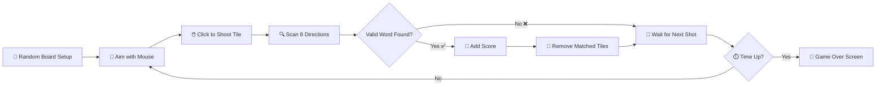

<div align="center">


<a href="https://github.com/AbdulAzeemHashmi/Word-Shooter-Game">
  
</a>


</div>

---

## 🎯 About

A fast paced **Word Shooter** game built entirely in **C++17** with **OpenGL/GLUT**. 🎮

Shoot letter tiles from a cannon at the bottom of the screen and match them with letters already on the board to form **valid English words**. Everything happens live inside one window: real time scoring 💯, a countdown timer ⏱️, and instant word validation 🔍.

The project features a **370,099 word dictionary** 📖, **8 directional word detection** (horizontal, vertical, and all 4 diagonals), and smooth **texture based rendering** 🎨 backed by a clean build system ⚙️.

<div align="center">

</div>

> 💡 Tip: Replace the animation above with an actual gameplay GIF once you record one. Tools like **ScreenToGif** or **Peek** work great for capturing OpenGL windows.

---

## ✨ Features

| Feature | Emoji | Status |
|---|---|---|
| Interactive shooter cannon | 🎯 | ✅ |
| 370,099 word dictionary (`words_alpha.txt`) | 📖 | ✅ |
| 2 minute timed rounds with live countdown | ⏱️ | ✅ |
| Letter tiles with texture rendering | 🔤 | ✅ |
| 8 directional word detection (H, V, 4 diagonals) | 🔍 | ✅ |
| Dynamic scoring based on word length | 💯 | ✅ |
| Binary texture data (`image-data.bin`) | 🎨 | ✅ |
| Mouse based targeting and shooting | 🖱️ | ✅ |
| Real time score display | 📊 | ✅ |
| Makefile build system | ⚙️ | ✅ |

---

## 🚀 Quick Start

### 1️⃣ Install FreeGLUT

<table>
<tr><th>OS</th><th>Command</th></tr>
<tr>
<td>🐧 Linux</td>
<td>

```bash
sudo apt install freeglut3-dev build-essential libfreeimage-dev
```

</td>
</tr>
<tr>
<td>🍎 macOS</td>
<td>

```bash
brew install freeglut freeimage
```

</td>
</tr>
<tr>
<td>🪟 Windows</td>
<td>MinGW w64 plus freeglut (copy <code>freeglut.dll</code> next to the exe)</td>
</tr>
</table>

### 2️⃣ Build

```bash
make
```

Or compile manually:

```bash
g++ wordshooter.cpp util.cpp -o word-shooter -lGL -lGLU -lglut -lfreeimage -std=c++17 -Wall -Wextra
```

### 3️⃣ Run

```bash
./word-shooter
```

<div align="center">

</div>

---

## 🕹️ Controls

| Input | Action |
|---|---|
| 🖱️ Mouse Move | Aim the shooter cannon |
| 🖱️ Left Click | Shoot the letter tile toward the target |
| ⌨️ ESC | Quit the game |

---

## 📁 File Tree

```
Word-Shooter-Game/
├── wordshooter.cpp      🎮 main game logic
├── util.cpp             🧰 utility functions
├── util.h                🧰 utility headers
├── Board.cpp             🧩 board management
├── Board.h                🧩 board declarations
├── CImg.h                 🖼️ image processing library
├── image-data.bin         🎨 precompiled texture data
├── words_alpha.txt        📖 370,099 English words
├── Makefile                ⚙️ build configuration
├── install-libraries.sh    🛠️ dependency installer
└── README.md               📄 this file
```

---

## 🎮 Gameplay

### 🎯 Objective

Form valid English words within **2 minutes** to score as many points as possible.

### 🔄 How It Works



1. **Random Board Initialization** 🎲
   Two rows of randomly selected letter tiles (30 total, 15 per row), plus a random letter loaded into the shooter cannon at the bottom center.

2. **Shooting Mechanism** 🎯
   A mouse click targets a location on the board. The letter shoots from the cannon toward that position and lands on the board.

3. **Word Detection** 🔍
   After placement, the game scans all 8 directions (horizontal, vertical, diagonal) and finds the longest valid word containing the placed tile, checked against the 370k word dictionary.

4. **Scoring** 💯
   Points equal the length of the valid word found. Matched words are removed from the board, and the score updates in real time.

5. **Game End** 🏁
   When the 120 second timer hits zero, a game over screen shows the final score. Rerun the program to play again 🔁.

---

## 🛠️ Configuration Constants

Edit the **top of `wordshooter.cpp`** to tweak gameplay:

| Constant | Default | Meaning |
|---|---|---|
| `width` | 930 | canvas width in pixels 📐 |
| `height` | 660 | canvas height in pixels 📐 |
| `bradius` | 30 | ball/tile radius ⚪ |
| `timeLeft` | 120 | round duration in seconds ⏱️ |
| `nalphabets` | 26 | number of letters, A through Z 🔤 |
| `dictionarysize` | 370099 | dictionary entries 📖 |
| `FPS` | 10 | frames per second 🎞️ |

---

## 📊 Dictionary & Validation

The `words_alpha.txt` file contains **370,099 English words** 📖:

* One word per line, sorted alphabetically 🔤
* Loaded fully into memory at startup 🚀
* Searched during word validation 🔍

**Sample validation flow:**

```
User shoots 'O' at position (5, 1)
Scan all 8 directions from (5, 1):
  → Horizontal: "CAT" ✅ Found in dictionary!
  → Vertical: "O" (single letter, ignored)
  → Diagonals: checked...
Highest scoring word: "CAT" (length 3)
Score += 3 💯
Remove matched tiles 🧹
```

---

## 🎨 Graphics & Rendering

### 🖼️ Texture System

* 26 letter textures (`a.bmp` through `z.bmp`) 🔤
* Precompiled into a single binary `image-data.bin` for fast loading ⚡
* Loaded via `RegisterTextures()` at startup 🚀
* Drawn using OpenGL quads with texture mapping 🎨

### 📐 Coordinate System

* Origin: bottom left corner (0, 0)
* X axis: left to right ➡️
* Y axis: bottom to top ⬆️
* Board: top left quadrant with a 15x2 grid 🧩

---

## 🧪 Extending the Game

| Idea | How | Emoji |
|---|---|---|
| Difficulty Levels | Reduce `timeLeft` or increase board size | 🔥 |
| Multiplayer | Add split screen or alternating turns | 👥 |
| Power ups | Add bomb tiles or time extensions | 💣 |
| Combo Bonuses | Extra points for multiple words per placement | 🔗 |
| Leaderboard | Save top scores to a binary file | 🏆 |
| Sound Effects | Use system calls or an audio library | 🔊 |
| Themes | Toggle board colors or tile styles | 🎨 |

---

## 🐛 Known Limitations

* 🔍 **Linear dictionary search**, can be optimized with binary search
* 👤 **Single player only**, no network or local multiplayer
* 🧩 **Board mechanics**, no gravity or tile shifting
* 💣 **No power ups**, basic mechanics only
* 🎨 **Texture loading**, requires a precompiled `image-data.bin`

---

## 🔧 Troubleshooting

| Issue | Solution |
|---|---|
| ❌ "Couldn't Read the Image Data file" | Ensure `image-data.bin` is in the working directory |
| ❌ Missing dictionary words | Verify `words_alpha.txt` is in the working directory |
| ❌ Compilation errors | Install FreeGLUT with `sudo apt install freeglut3-dev` |
| ❌ No textures display | Ensure the binary texture file is valid |
| 🐢 Slow performance | Reduce the `FPS` constant or optimize dictionary search |

---

## 👨‍💻 Author

<div align="center">


### Abdul Azeem Hashmi
Programming Fundamentals Project 📚 | AI-A Batch | 24i-2013

[](https://github.com/AbdulAzeemHashmi)
[](https://github.com/AbdulAzeemHashmi/Word-Shooter-Game)

</div>

---

## 📄 License

This project is provided as is for educational purposes 🎓.

<div align="center">

⭐ If you enjoyed this project, consider giving it a star on GitHub! ⭐


</div>
